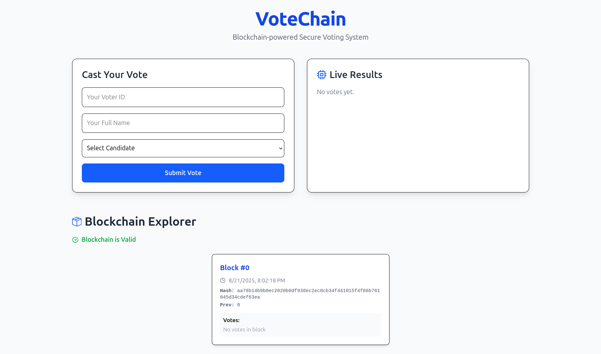
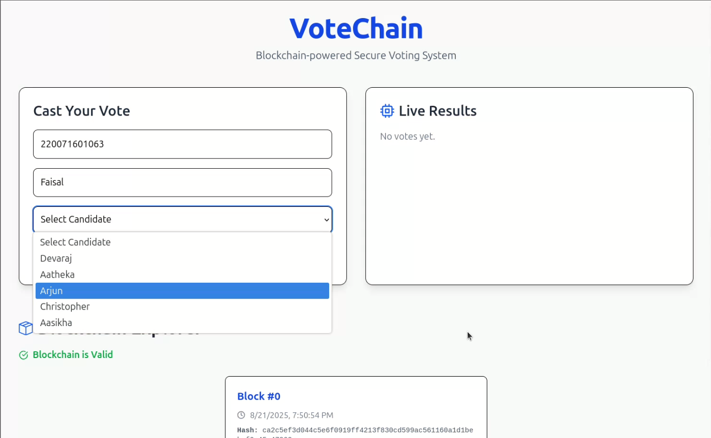
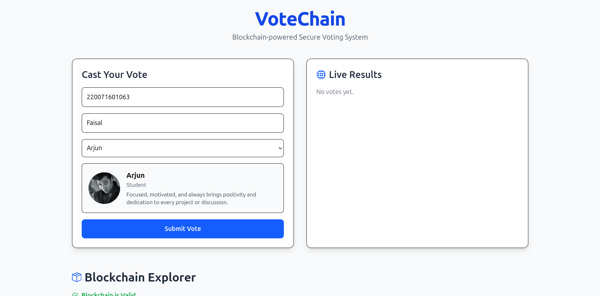
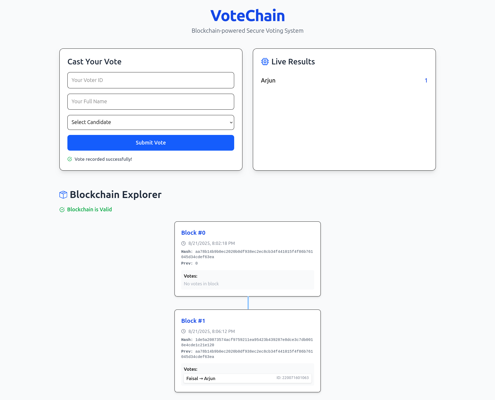
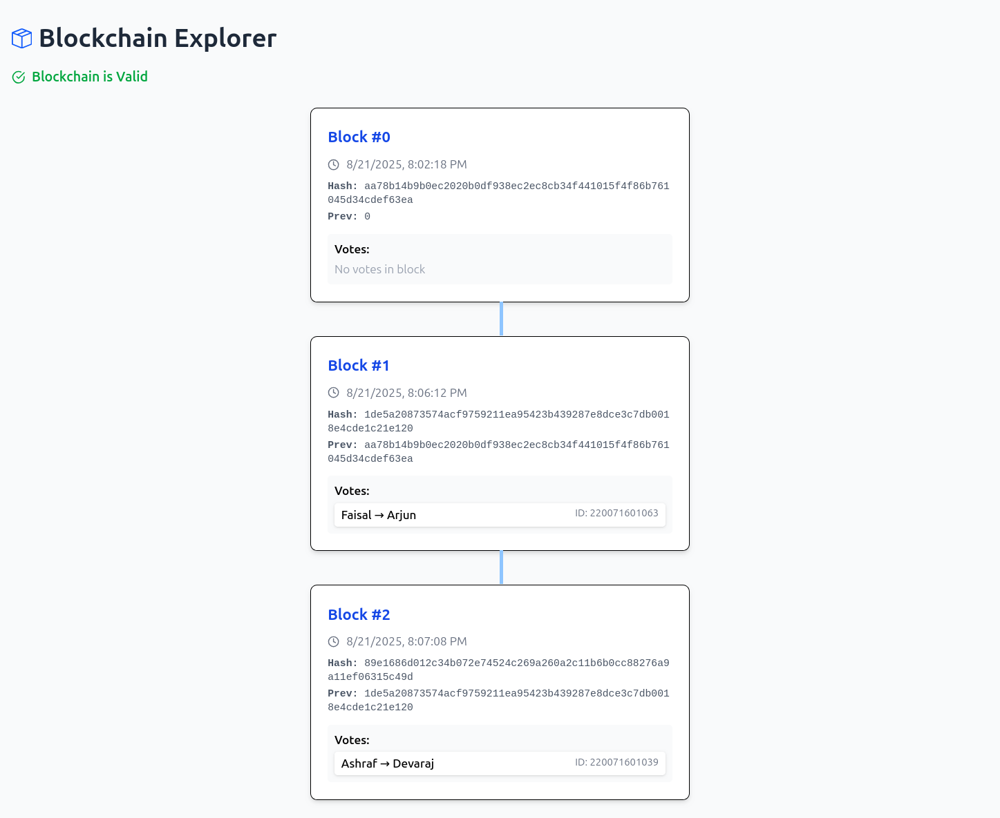

# 🗳️ VoteChain

**VoteChain** is a blockchain-powered voting simulation web application built with **React**, **Tailwind CSS**, and **Node.js/Express.js**, featuring live vote results, candidate cards with bios, and a blockchain explorer for transparency. Votes are simulated and not stored permanently.

The blockchain in this project is implemented as a simple proof-of-concept using **blocks, hashes, and a linked chain structure**. Each vote is stored in a block containing:

- **Index**: Position in the chain
- **Timestamp**: When the vote was cast
- **Votes**: Array of votes in the block
- **Previous Hash**: Hash of the previous block to maintain immutability
- **Hash**: SHA-256 hash of the block's contents

This ensures that any tampering with previous votes invalidates the chain, simulating blockchain integrity and transparency.

## ✨ Features

- Cast votes with voter ID and name
- Select candidates from a dropdown
- View candidate details (bio, role, avatar)
- Live vote results display
- Blockchain explorer showing each block with votes

## 🖼️ Screenshots

### 🏠 Homepage



### 🎯 Candidate Selection

#### Dropdown List of Candidates



#### Selected Candidate Card



### ✅ Vote Successfully Cast & Result Updated



### 🔗 Blockchain Explorer



## 🧰 Tech Stack

- React
- Tailwind CSS
- Node.js / Express.js
- Framer Motion
- React Icons

## 🚀 Getting Started

Follow these steps to run the project locally:

### 1. Clone the repository

```bash
git clone https://github.com/Fa1sall/VoteChain.git
cd TrueGoods
```

### 2. Setup & run backend

```bash
cd backend
npm install
node server.js
```

### 3. Setup & run frontend

```bash
cd frontend
npm install
npm run dev
```
